# GitLab CI/CD Dashboard

A feature-rich dashboard for visualizing CI/CD metrics, deployment status, and merge request health across GitLab groups and projects.

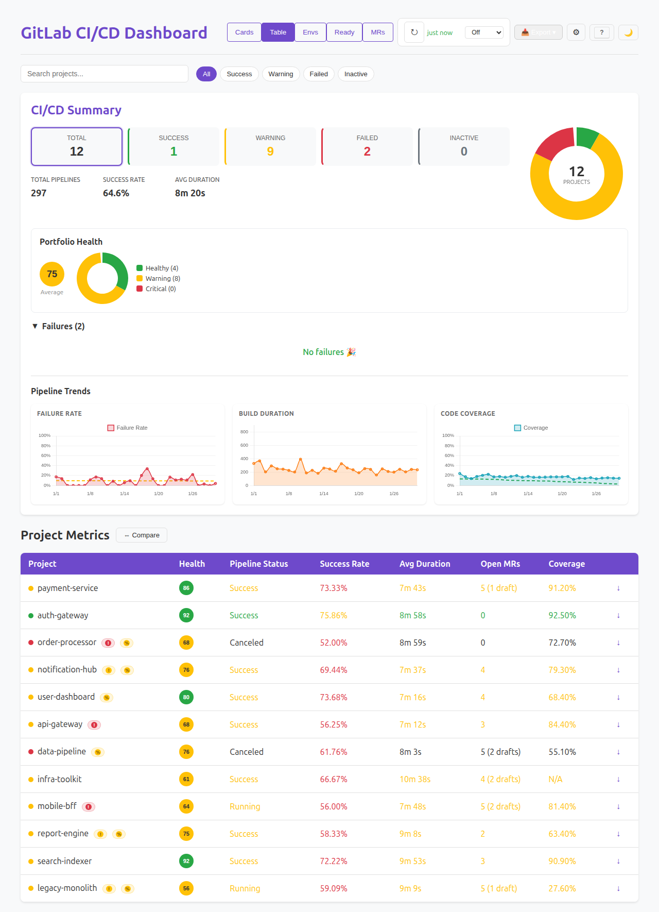

## Features

### Core Dashboard
- **Multi-source configuration** — monitor multiple GitLab groups and individual projects from a single dashboard
- **Pipeline metrics** — success/failure rates, build durations, code coverage tracking
- **Health scoring** — composite health score (0–100) per project with colour-coded badges
- **Portfolio health** — aggregate health donut chart and summary statistics
- **Pipeline trends** — failure rate, build duration, and coverage trend charts over configurable timeframes (7/30/90 days)
- **Dark mode** — full dark theme with chart support
- **Persistent settings** — all configuration saved to localStorage

### Views

| View | Description |
|------|-------------|
| **Table** | Sortable project table with health scores, pipeline status, success rate, duration, open MRs, coverage |
| **Cards** | Card-based layout grouped by status (Failed → Warning → Successful) with detailed per-project metrics |
| **Environment Matrix** | Grid showing deployment status across DEV/SIT/UAT/PROD per project |
| **Readiness** | Promotion readiness view — deployment status, sign-offs, post-deploy test results per environment |
| **MR Board** | Kanban-style board grouping open MRs by pipeline status (Passing/Failing/Running/Draft/No Pipeline) |

### Features (F01–F10)

- **F01 Health Score** — composite scoring algorithm weighing success rate, coverage, duration, failure rate
- **F02 Comparison View** — side-by-side multi-project comparison with overlay charts
- **F03 Saved Configs** — save/load/export/import dashboard configurations
- **F04 Notification Rules** — browser notifications for pipeline failures, coverage drops, duration spikes
- **F05 Auto-Refresh** — configurable auto-refresh with visibility API pause and stale data banner
- **F06 Failure Diagnosis** — job log viewer with pattern detection (dependency/infra/test/timeout), failure frequency analysis
- **F07 MR Pipeline Board** — cross-project MR aggregation in Kanban columns
- **F08 Deployment Timeline** — activity feed with rollback detection and version comparison
- **F09 Keyboard Shortcuts** — 13 shortcuts for navigation (j/k, view switching, search focus, etc.)
- **F10 Exportable Reports** — CSV export and lazy-loaded PDF generation (jspdf)

## Getting Started

### Prerequisites

- Node.js 18+ (20+ recommended)
- npm

### Install & Run

```bash
npm install
npm run dev
```

Open http://localhost:5050, enter your GitLab URL, private token, and group/project IDs.

### Running with Mock Data (No Token Required)

For demos, development, or UI work — use the built-in mock GitLab API:

```bash
# Terminal 1: Start mock API server (12 realistic projects)
npm run mock:api

# Terminal 2: Run dashboard
npm run dev
```

Then configure the dashboard with any token and group ID `99001`.

Or run the full mock showcase test suite:

```bash
npm run test:e2e:mock
```

This captures 22 screenshots across all views in `showcase/mock/`.

## Testing

```bash
# Unit tests (733 tests across 53 files)
npm test

# Unit tests with coverage
npm run test:coverage

# E2E tests (requires Playwright browsers)
npx playwright install chromium
npm run test:e2e

# E2E with mock data (no GitLab token needed)
npm run test:e2e:mock
```

### Test Structure

| Location | Type | Description |
|----------|------|-------------|
| `src/**/*.test.ts` | Unit | Component and utility tests (vitest + testing-library) |
| `e2e/dashboard.spec.ts` | E2E | Basic UI tests (no data required) |
| `e2e/dashboard-with-data.spec.ts` | E2E | Full tests with real GitLab token (`GITLAB_TOKEN` env) |
| `e2e/feature-showcase.spec.ts` | E2E | Screenshot capture of UI elements |
| `e2e/mock-populated.spec.ts` | E2E | **Full populated dashboard screenshots using mock API** |

### Mock GitLab API Server

`scripts/mock-gitlab-api.mjs` is a standalone Node.js HTTP server (no dependencies) that implements 16 GitLab API v4 endpoints with realistic generated data:

- **12 projects** with varied statuses, coverage levels, and pipeline histories
- **Deterministic output** — seeded PRNG for reproducible screenshots
- **Realistic data** — proper JIRA branch naming, multiple authors, deploy jobs, test reports, job traces, CODEOWNERS, MR notes with sign-offs
- Runs on port 4000 by default (`MOCK_PORT` env to override)

The Playwright test (`e2e/mock-populated.spec.ts`) auto-starts the mock server and intercepts browser requests via `page.route()`, so no proxy configuration changes are needed.

## Screenshots

All screenshots are generated automatically from the mock API and live in `showcase/mock/`. See the [full showcase gallery](showcase/mock/).

<details>
<summary>View screenshots</summary>

### Table View
| Light | Dark |
|-------|------|
|  | 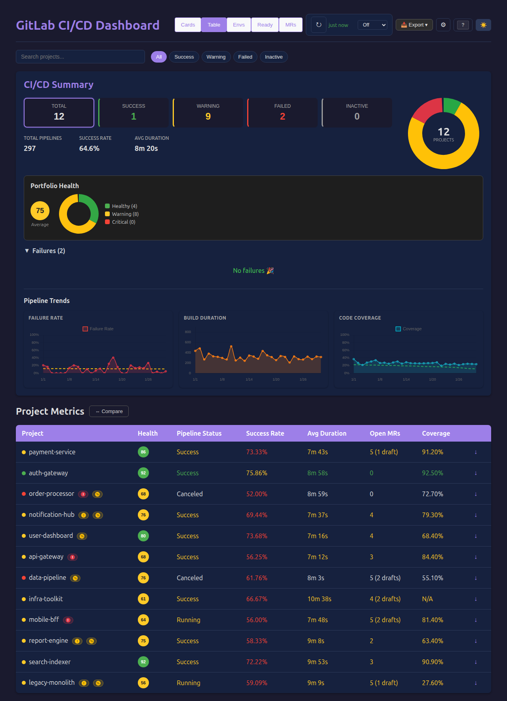 |

### Card View
| Light | Dark |
|-------|------|
| 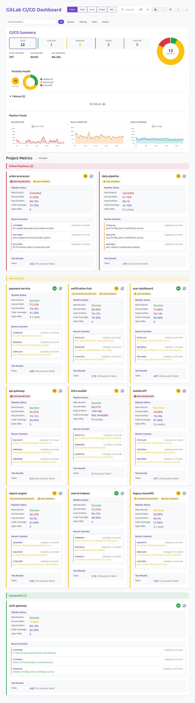 | 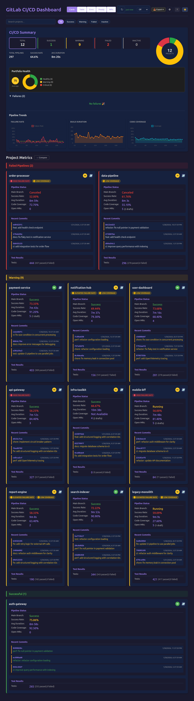 |

### Environment Matrix
| Light | Dark |
|-------|------|
| 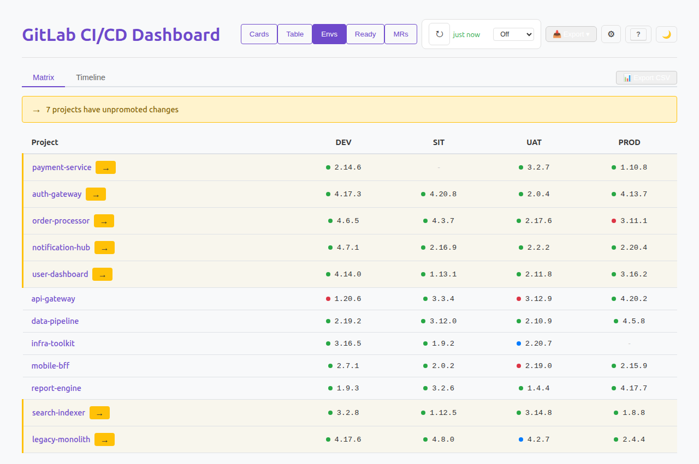 | 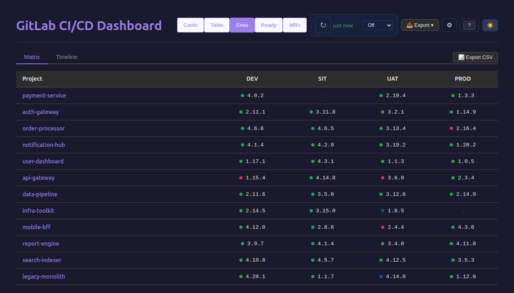 |

### Readiness View
| Light | Dark |
|-------|------|
| 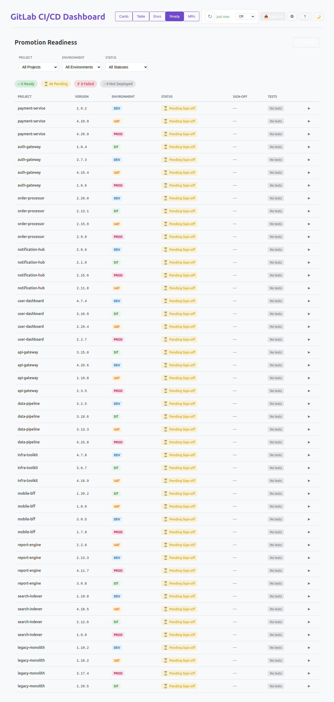 | 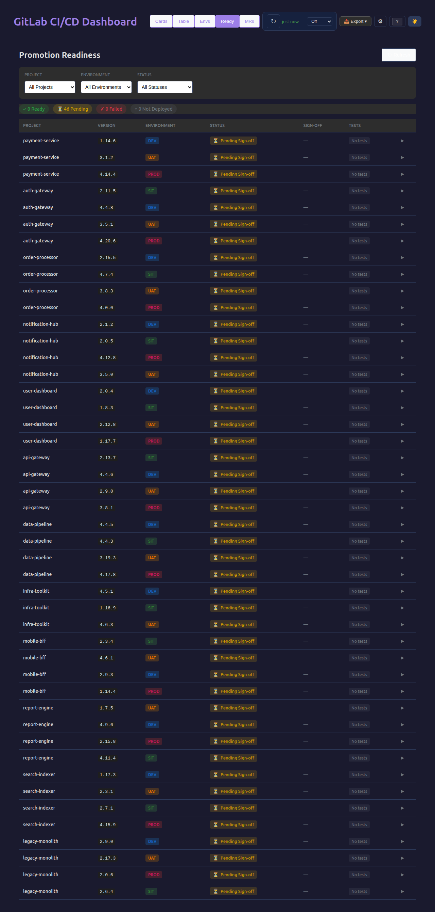 |

### MR Pipeline Board
| Light | Dark |
|-------|------|
| 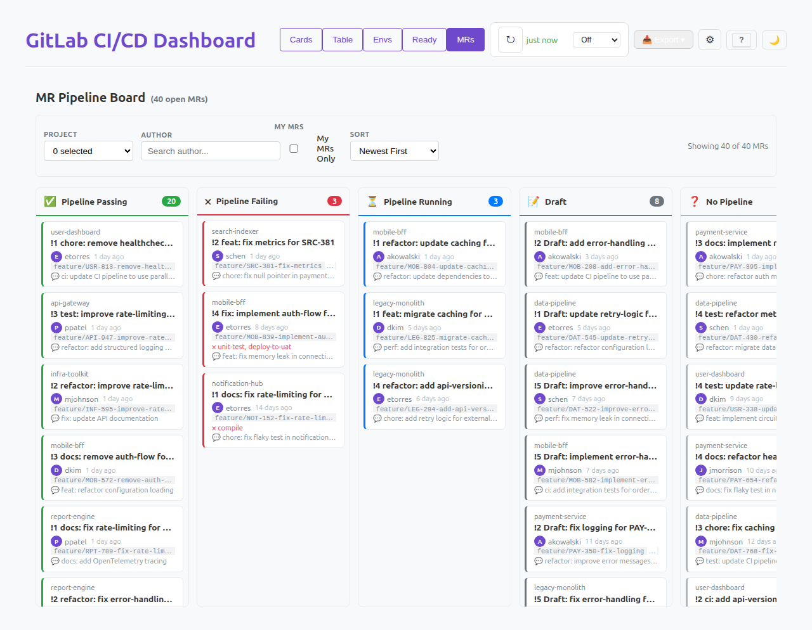 |  |

### Other Views
| Project Details | Keyboard Shortcuts | Mobile |
|----------------|-------------------|--------|
| 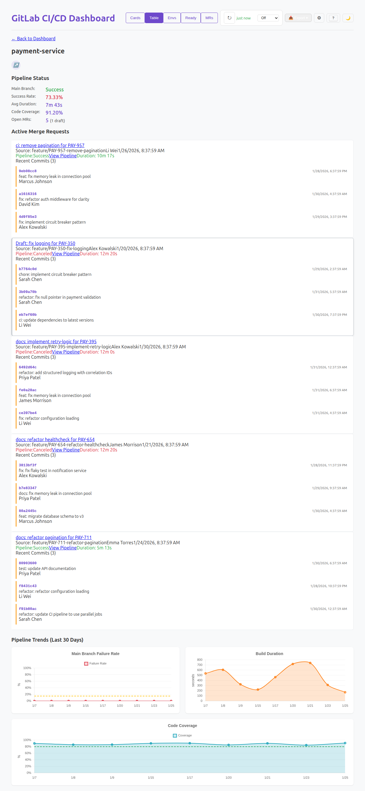 | 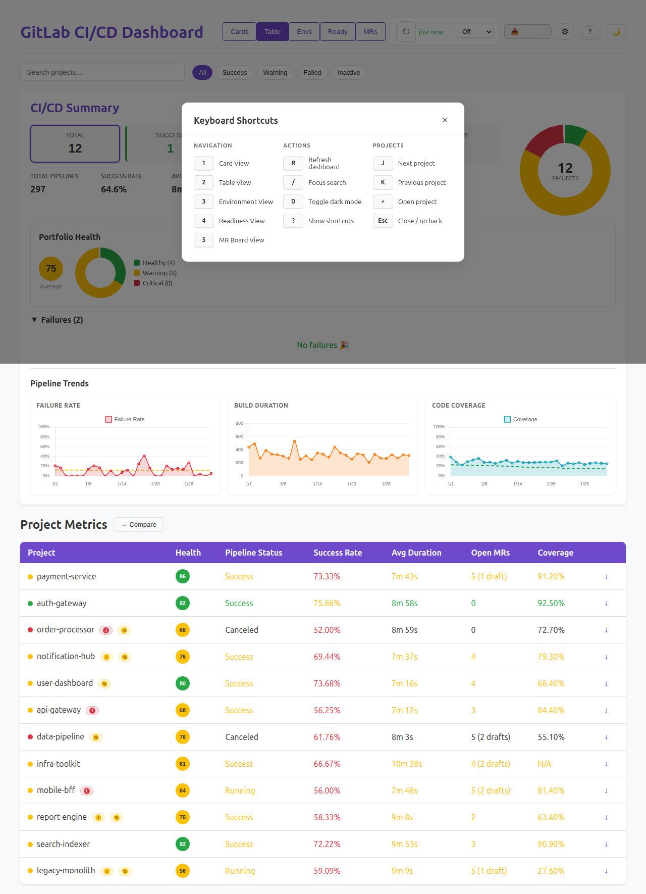 | 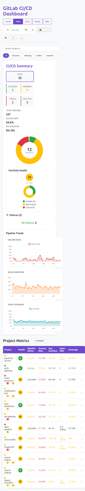 |

</details>

## Tech Stack

- **React 18** + TypeScript
- **Vite** — dev server and build
- **Chart.js** + react-chartjs-2 — trend charts and donut charts
- **jspdf** + jspdf-autotable — PDF export
- **Vitest** — unit testing
- **Playwright** — E2E testing
- **GitLab API v4** — data source

## npm Scripts

| Script | Description |
|--------|-------------|
| `dev` | Start Vite dev server (port 5050) |
| `build` | TypeScript check + Vite production build |
| `test` | Run unit tests |
| `test:coverage` | Unit tests with coverage report |
| `test:e2e` | Run all Playwright E2E tests |
| `test:e2e:mock` | Run mock-populated E2E tests (no token needed) |
| `mock:api` | Start the mock GitLab API server |
| `preview` | Preview production build |

## Project Structure

```
├── src/
│   ├── components/      # React components (Dashboard, ProjectDetails, views, etc.)
│   ├── services/        # GitLabApiService, DashboardDataService
│   ├── utils/           # Health scoring, notifications, export, diagnosis, etc.
│   ├── types/           # TypeScript type definitions
│   └── test/            # Test setup and mocks
├── e2e/                 # Playwright E2E tests
├── scripts/             # Mock API server, deployment scripts
├── showcase/            # Generated screenshots
│   └── mock/            # Mock-data populated screenshots (22 images)
├── specs/               # Feature specifications (Ralph workflow)
└── docs/                # Additional documentation
```

## Versioning

Uses [semantic-release](https://github.com/semantic-release/semantic-release) with [Conventional Commits](https://www.conventionalcommits.org/).

## License

Private project.
